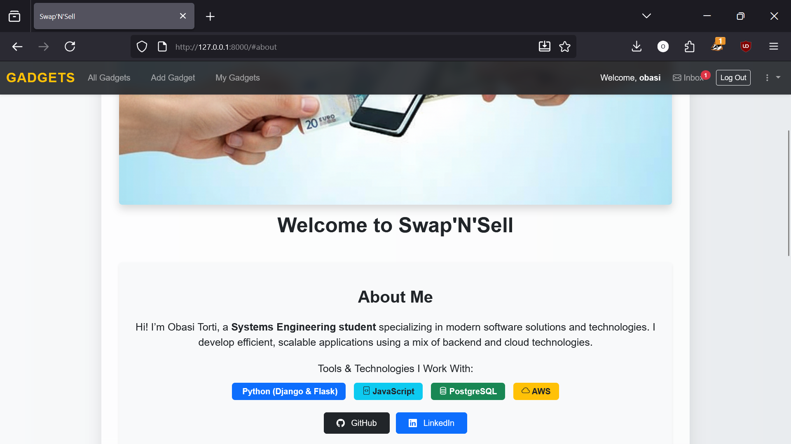
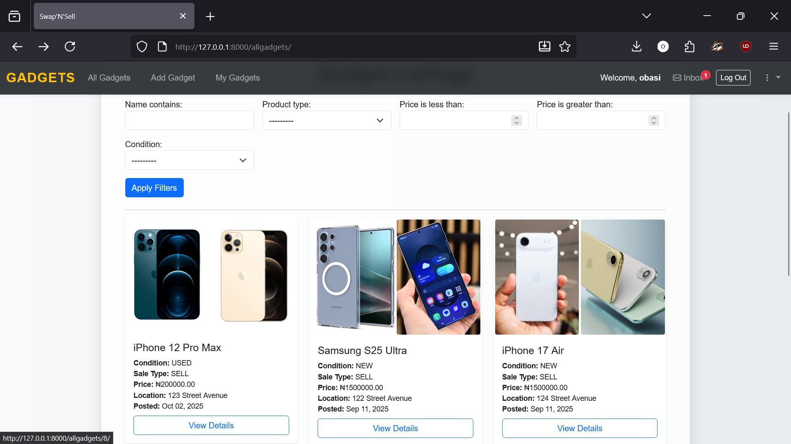
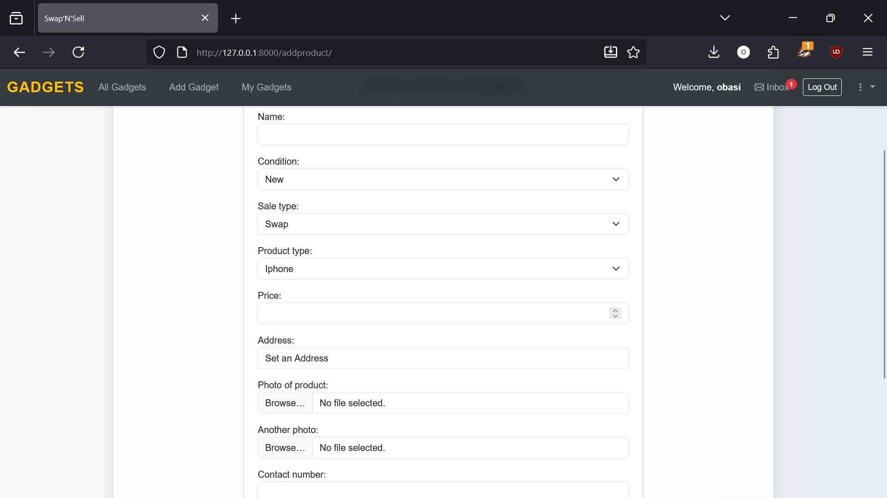
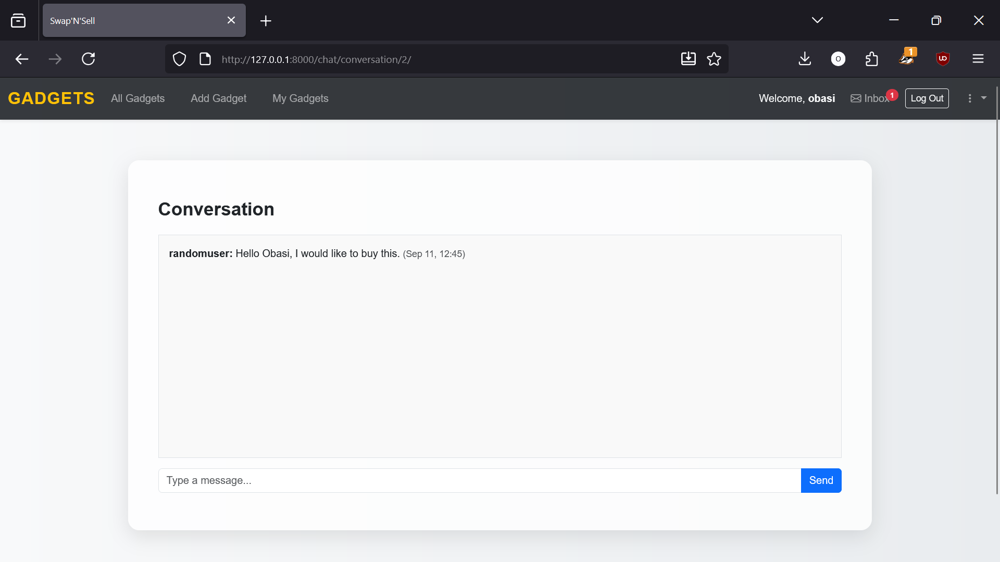

# SwapNSell

A Django-based marketplace application for buying, selling, and swapping items. Features integrated AWS S3 storage for media files and a responsive, mobile-friendly interface.

---

## Features

- 🔐 User authentication and registration
- 📦 Create listings for items to sell or swap
- 📸 Image uploads with AWS S3 integration
- 🔍 Search and filter listings
- 💬 Real-time messaging system
- 📱 Fully responsive UI
- 🛡️ Admin dashboard for content management

---

## Screenshots

### Homepage


### Item Listing


### Create Listing


### Messaging System


---

## Prerequisites

- Python 3.8 or higher
- pip package manager
- AWS account with S3 bucket
- PostgreSQL database (optional for production)

---

## Installation

### 1. Clone the Repository

```bash
git clone https://github.com/obasitorti/swapnsell.git
cd swapnsell
```

### 2. Create Virtual Environment

```bash
python -m venv venv
```

### 3. Activate Virtual Environment

**Windows:**
```bash
venv\Scripts\activate
```

**macOS/Linux:**
```bash
source venv/bin/activate
```

### 4. Install Dependencies

```bash
pip install -r requirements.txt
```

### 5. Configure Environment Variables

Create a `.env` file in the project root directory:

```env
# Django Settings
DEBUG=True
SECRET_KEY=your-django-secret-key

# Database (PostgreSQL)
DB_NAME=your_db_name
DB_USER=your_db_user
DB_PASSWORD=your_db_password
DB_HOST=your_db_host
DB_PORT=5432

# AWS S3 Configuration
AWS_ACCESS_KEY_ID=your_aws_access_key
AWS_SECRET_ACCESS_KEY=your_aws_secret_key
AWS_STORAGE_BUCKET_NAME=your_bucket_name
AWS_S3_REGION_NAME=us-east-1
```

**Note:** Copy `.env.example` to `.env` and fill in your actual credentials.

### 6. Set Up AWS S3 Bucket

1. Create an S3 bucket in your AWS account
2. Set bucket policy for public read access:

```json
{
  "Version": "2012-10-17",
  "Statement": [
    {
      "Sid": "PublicReadGetObject",
      "Effect": "Allow",
      "Principal": "*",
      "Action": "s3:GetObject",
      "Resource": "arn:aws:s3:::your-bucket-name/*"
    }
  ]
}
```

3. Create IAM user with S3 permissions and generate access keys

### 7. Run Database Migrations

```bash
python manage.py migrate
```

### 8. Collect Static Files

```bash
python manage.py collectstatic
```

### 9. Create Superuser (Admin Account)

```bash
python manage.py createsuperuser
```

### 10. Run Development Server

```bash
python manage.py runserver
```

Visit `http://127.0.0.1:8000` in your browser.

---

## Usage

### Posting an Item

1. Register or log in to your account
2. Click **"Post Item"** from the navigation menu
3. Fill in item details (title, description, price, category, etc.)
4. Upload item images (stored automatically in AWS S3)
5. Submit your listing

### Browsing Items

- View all listings on the homepage
- Use the search bar to find specific items
- Filter by categories, price range, or condition
- Click on any item for detailed information

### Messaging

- Contact sellers directly through the built-in messaging system
- View your message history in the Messages section

### Admin Panel

- Access at `/admin` with your superuser credentials
- Manage users, listings, and site settings
- Monitor reported content and user activity

---

## Project Structure

```
swapnsell/
├── baseapp/              # Main Django project settings
├── swapandsell/          # Core app for listings
├── users/                # User authentication and profiles
├── chat/                 # Messaging system
├── static/               # Static files (CSS, JS, images)
├── templates/            # HTML templates
├── .env                  # Environment variables (not in Git)
├── .env.example          # Example environment file
├── manage.py             # Django management script
└── requirements.txt      # Python dependencies
```

---

## Deployment

For production deployment:

### 1. Update Settings

```env
DEBUG=False
ALLOWED_HOSTS=yourdomain.com,www.yourdomain.com
```

### 2. Use Production Server

Install Gunicorn:
```bash
pip install gunicorn
```

Run with Gunicorn:
```bash
gunicorn baseapp.wsgi:application --bind 0.0.0.0:8000
```

### 3. Configure HTTPS

- Use a reverse proxy (Nginx/Apache)
- Obtain SSL certificate (Let's Encrypt recommended)

### 4. Database

- Use PostgreSQL or MySQL for production
- Configure database backups

---

## Technologies Used

- **Backend:** Django 5.2.3
- **Database:** PostgreSQL
- **Storage:** AWS S3
- **Frontend:** HTML, CSS, Bootstrap 5, JavaScript
- **Authentication:** Django built-in auth system
- **File Uploads:** django-storages, boto3

---

## Contributing

1. Fork the repository
2. Create a feature branch (`git checkout -b feature/new-feature`)
3. Commit your changes (`git commit -m 'Add new feature'`)
4. Push to the branch (`git push origin feature/new-feature`)
5. Open a Pull Request

---

## License

This project is licensed under the MIT License.

---

## Support

For issues or questions:
- Open an issue on GitHub
- Contact: [your-email@example.com]

---

## Acknowledgments

- Django documentation
- AWS S3 documentation
- Bootstrap framework
- All contributors and testers